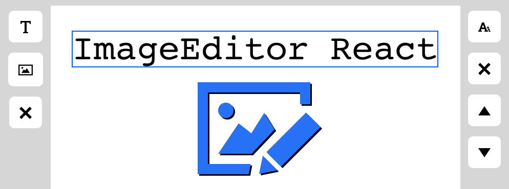

# Image Editor React

* [What is this?](#intro)
* [Features](#Features)
* [Local Installation](#localinstall)
* [Application demo](#Linktoapplicationdemo)
* [Screenshots of app](#Screenshotsofapp)
* [Technologies used](#Technologiesused)
* [Shouts outs and Credit](#ResourcesShoutsoutsCredit)

##  What is this?
* This is an image editor built with simplicity in mind. Making modifications to images shouldn't be a struggle. Stop before you spend five minutes booting up that old, slow image editing software. This editor is fast, so you can be too.

##  Features
* Upload images to the canvas instantly.
* Create and edit shapes and more to create your perfect project.

##  Local Installation
1. Start by cloning this repo with git
1. Navigate to the project directory
1. Run: `npm install`
1. Run: `npm run start`

##  Application demo
* Check out the [live demo](https://jewarner57.github.io/ImageEditor-React/)!

##  Screenshots of app

##  Technologies used
* Built with React and Redux

##  Shout outs and Credit
* Shout out to [this medium article](https://medium.com/@pdx.lucasm/canvas-with-react-js-32e133c05258) that got me started.